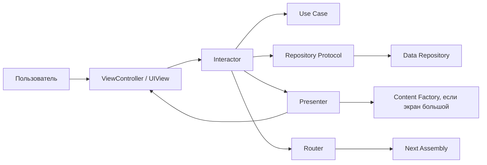

# ClubKapitanovApp: подробный справочник по проекту

> Документ для спокойного изучения проекта от общей картины до конкретных файлов.
> Он объясняет не только "что лежит в файле", но и почему оно лежит именно там,
> какие связи есть между слоями и какие решения уже заложены под развитие проекта.

## Оглавление

1. [Как читать этот проект](#как-читать-этот-проект)
2. [Главная идея приложения](#главная-идея-приложения)
3. [Сквозной путь пользователя](#сквозной-путь-пользователя)
4. [Архитектурная карта](#архитектурная-карта)
5. [Как данные текут через VIP](#как-данные-текут-через-vip)
6. [Файлы проекта верхнего уровня](#файлы-проекта-верхнего-уровня)
7. [App: запуск, окно и зависимости](#app-запуск-окно-и-зависимости)
8. [Core: общие технические кирпичи](#core-общие-технические-кирпичи)
9. [Domain: бизнес-модель проекта](#domain-бизнес-модель-проекта)
10. [Data: временное in-memory хранилище](#data-временное-in-memory-хранилище)
11. [Features: пользовательские сценарии](#features-пользовательские-сценарии)
12. [Assets: ресурсы и бренд](#assets-ресурсы-и-бренд)
13. [Docs: документация проекта](#docs-документация-проекта)
14. [Xcode project: как Xcode собирает приложение](#xcode-project-как-xcode-собирает-приложение)
15. [Пустые директории](#пустые-директории)
16. [Что сейчас особенно важно понимать](#что-сейчас-особенно-важно-понимать)
17. [Карта всех файлов](#карта-всех-файлов)

---

## Как читать этот проект

Проект написан как UIKit-приложение для iPad. UI создается кодом, без storyboard.
Архитектурно он разбит на несколько слоев:

- `App` запускает приложение, создает окно и связывает зависимости.
- `Core` содержит дизайн-систему, форматирование и UIKit-helper'ы.
- `Domain` описывает бизнес-сущности, use case'ы и протоколы репозиториев.
- `Data` дает временные in-memory реализации этих репозиториев.
- `Features` содержит экраны и пользовательские сценарии.
- `Assets.xcassets` хранит изображения и цвета.
- `Docs` фиксирует продуктовый и технический контекст.

Чтобы понять проект с нуля, лучше читать в таком порядке:

1. `AGENTS.md` - стек проекта, команды, правила кода и самопроверки.
2. Этот файл - подробный путеводитель по каждому файлу.
3. `App/SceneDelegate.swift` и `App/AppDIContainer.swift` - где стартует приложение.
4. `Domain` - какие сущности являются языком проекта.
5. `Data` - откуда сейчас берутся пользователи, точки и каталоги.
6. `Features/Auth`, `Features/PointSelection`, `Features/Shift/OpenShift`, `Features/Workspace` - как работает пользовательский flow.

Главный принцип чтения: UI-файл почти никогда не должен быть источником бизнес-правил.
Если на экране что-то происходит, ищите событие в `ViewController`, затем метод
`Interactor`, затем presenter/factory, которые превращают результат в текст и карточки.

---

## Главная идея приложения

`ClubKapitanovApp` - внутреннее рабочее приложение точки проката. MVP рассчитан на iPad:
сотрудник входит по PIN, выбирает точку, открывает смену, добавляет других сотрудников,
ведет прокат, фиксирует сувенирку и штрафы, завершает активные заказы и закрывает смену
с итоговым snapshot-отчетом.

Сейчас данные живут только в памяти приложения. Это сознательный этап: архитектура уже
разделяет `Domain`, `Data` и `Features`, поэтому постоянный storage или backend должен
подключаться через новые реализации репозиториев, а не через переписывание экранов.

Важные бизнес-решения:

- валюта только рубли;
- деньги хранятся через `Money`, а не как разрозненные числа;
- состояние "сотрудник на смене" принадлежит `ShiftParticipant`, а не `User`;
- на одной точке должна быть только одна открытая смена;
- закрытие смены запрещено, пока есть активные заказы проката;
- исторические операции хранят snapshot-названия, snapshot-цены и snapshot-тарифы;
- итоговый отчет закрытия смены сохраняется отдельно от самой смены;
- admin-flow не смешивается с рабочим iPad-flow.

---

## Сквозной путь пользователя

### 1. Запуск приложения

`AppDelegate` принимает стандартный iOS lifecycle. Реальная сборка UI начинается в
`SceneDelegate`: создается `AppDIContainer`, затем `LoginAssembly` собирает первый
экран, а он кладется в `UINavigationController`.

### 2. PIN-вход

`LoginViewController` показывает поле PIN и кнопку. При нажатии он отправляет
`Login.Submit.Request` в `LoginInteractor`. Interactor:

- чистит пробелы;
- проверяет формат: ровно 4 цифры;
- вызывает `LoginUseCase`;
- получает пользователя из `AuthRepository`;
- отсекает admin-пользователя;
- просит presenter показать ошибку или успех;
- при успехе вызывает router.

`LoginRouter` переводит staff/manager в выбор точки.

### 3. Выбор точки

`PointSelectionInteractor` спрашивает `PointRepository`, какие активные точки доступны
пользователю. `staff` видит все активные точки, `manager` - только закрепленную точку.
Presenter превращает `Point` в строки таблицы. По выбору строки router открывает
экран открытия смены.

### 4. Открытие смены

`OpenShiftInteractor` проверяет, есть ли уже открытая смена на точке. Если есть,
переходит в нее. Если нет, создает новую `Shift`:

- генерирует `shiftID`;
- создает host-устройство типа `iPad`;
- добавляет первого участника смены;
- добавляет connection в режиме `ipadOperator`;
- сохраняет смену в `ShiftRepository`.

`OpenShiftRouter` заменяет navigation stack на workspace, чтобы пользователь не мог
вернуться назад к открытию уже открытой смены.

### 5. Workspace смены

`ShiftWorkspaceAssembly` собирает главный рабочий экран. Он подтягивает каталоги точки:

- типы проката;
- сувенирку;
- шаблоны штрафов.

`ShiftWorkspaceInteractor` хранит mutable state рабочего экрана: текущую смену, операции,
выбранный раздел, активные/завершенные заказы, продажи и штрафы. После каждой операции
он синхронизирует состояние с `ShiftRepository`.

В workspace есть разделы:

- `Утки` - создание и завершение активных заказов проката;
- `Сувенирка` - добавление продаж с количеством;
- `Штрафы` - добавление штрафов с количеством;
- `Временный отчет` - сводка текущих операций;
- `История / Закрытие смены` - подтверждение закрытия.

### 6. Закрытие смены

Перед закрытием `ShiftWorkspaceInteractor` проверяет, что нет активных заказов. Затем:

- сохраняет текущие операции в shift repository;
- строит `ShiftCloseReport` через `BuildShiftCloseReportUseCase`;
- сохраняет report в `ReportRepository`;
- закрывает смену через `ShiftRepository.closeShift`;
- возвращает navigation stack к Login.

---

## Архитектурная карта

Проект использует VIP-подход для экранов:

- `ViewController` принимает пользовательские события и отображает ViewModel.
- `Interactor` выполняет бизнес-действия, меняет state, вызывает репозитории/use case'ы.
- `Presenter` превращает domain/state в display-модели.
- `Router` отвечает за навигацию.
- `Assembly` собирает модуль и внедряет зависимости.
- `Models` содержит request/response/view model/state для модуля.

Почему это важно:

- UIKit не смешивается с бизнес-правилами;
- Data-слой можно заменить без переписывания UI;
- presenter и factory можно тестировать как чистое преобразование данных;
- Interactor становится местом, где видно поведение сценария.

Общая схема:

---

## Как данные текут через VIP

Пример на PIN-входе:

1. `LoginViewController.didTapLoginButton()` берет текст из `pinField`.
2. Создает `Login.Submit.Request(pinCode:)`.
3. `LoginInteractor.submit(request:)` проверяет PIN и вызывает `LoginUseCase`.
4. `LoginUseCase.execute(pinCode:)` обращается к `AuthRepository`.
5. `InMemoryAuthRepository.getUser(pinCode:)` ищет пользователя в фикстурах.
6. Interactor передает `Login.Submit.Response(user:)` в presenter.
7. `LoginPresenter` создает `Login.Submit.ViewModel`.
8. `LoginViewController.display(viewModel:)` показывает ошибку или очищает PIN.
9. Если вход успешен, `LoginRouter.routeToNextScreen(for:)` открывает выбор точки.

Пример на сувенирке:

1. `ShiftWorkspacePadContentView` показывает кнопку товара из `ActionButtonViewModel`.
2. Нажатие открывает `ShiftWorkspaceOperationConfirmModalView`.
3. Модалка возвращает количество в `ShiftWorkspacePadView`.
4. `ShiftWorkspaceViewController` вызывает `interactor.addSouvenir(at:quantity:)`.
5. Interactor меняет `state.souvenirSales`.
6. Interactor вызывает `persistCurrentOperations()`.
7. Presenter пересобирает `ShiftWorkspace.ViewModel`.
8. Content view заново строит текущий раздел.

---

## Файлы проекта верхнего уровня

### `.gitignore`

Что это:

- список файлов и папок, которые не нужно хранить в git.

Что игнорирует:

- `.DS_Store` - служебные файлы macOS;
- `DerivedData/` - локальная папка сборки Xcode;
- `build/` - локальные сборочные артефакты;
- `*.xcuserstate` - состояние интерфейса Xcode;
- `*.xcscmblueprint` - служебные данные source control в Xcode;
- `xcuserdata/` - пользовательские настройки Xcode.

Зачем так:

- проект должен хранить исходники и настройки сборки, но не локальное состояние IDE;
- разные разработчики не должны перетирать друг другу открытые вкладки, размеры окон
  и временные сборочные файлы.

Особенность текущей папки:

- в текущей директории нет `.git`, поэтому `git status` не работает;
- файл все равно полезен, если проект позже будет инициализирован как git-репозиторий.

---

## App: запуск, окно и зависимости

### `ClubKapitanovApp/App/AppDelegate.swift`

Что делает:

- является официальной точкой входа приложения через `@main`;
- подключает UIKit lifecycle;
- возвращает `true` из `didFinishLaunchingWithOptions`;
- создает `UISceneConfiguration` для новых сцен.

Как делает:

- класс наследуется от `UIResponder` и реализует `UIApplicationDelegate`;
- в проекте используется scene-based lifecycle, поэтому `AppDelegate` не создает окно;
- метод `configurationForConnecting` возвращает конфигурацию с именем
  `Default Configuration`.

Зачем так:

- начиная с современных iOS-проектов окно и UI часто создаются в `SceneDelegate`;
- `AppDelegate` остается минимальным системным делегатом;
- это снижает связность: запуск процесса отдельно, сборка UI отдельно.

На что смотреть:

- если появятся push-уведомления, analytics, crash reporting или глобальные SDK,
  часть их инициализации может оказаться здесь;
- root-flow приложения менять здесь не нужно, он в `SceneDelegate`.

### `ClubKapitanovApp/App/SceneDelegate.swift`

Что делает:

- создает `UIWindow`;
- создает `AppDIContainer`;
- собирает Login-модуль;
- кладет Login в `UINavigationController`;
- делает окно видимым.

Как делает:

- в `scene(_:willConnectTo:options:)` проверяет, что scene является `UIWindowScene`;
- создает контейнер один раз на сцену;
- задает `BrandColor.background` как цвет окна;
- вызывает `LoginAssembly.makeModule(container:)`;
- устанавливает `window.rootViewController`.

Зачем так:

- все модули в рамках одной сцены получают одни и те же in-memory репозитории;
- благодаря этому открытая смена и операции не теряются при переходах между экранами;
- стартовый flow находится в одном очевидном месте.

Важная связь:

- `SceneDelegate` зависит от `AppDIContainer`, `BrandColor`, `LoginAssembly`.

### `ClubKapitanovApp/App/AppDIContainer.swift`

Что делает:

- хранит конкретные реализации репозиториев;
- создает use case'ы;
- является единственной точкой выбора между in-memory и будущим постоянным storage/backend.

Как делает:

- содержит свойства:
  - `authRepository`;
  - `pointRepository`;
  - `catalogRepository`;
  - `shiftRepository`;
  - `reportRepository`;
  - `dateProvider`.
- в initializer по умолчанию подставляет in-memory реализации и системный источник времени;
- методы `makeLoginUseCase()`, `makeBuildShiftPayrollSummaryUseCase()`,
  `makeBuildShiftCloseReportUseCase()` и `makeShiftWorkspaceContentFactory()` создают зависимости модулей.

Зачем так:

- Feature-модули получают зависимости через Assembly, а не создают Data-слой сами;
- когда появится постоянное хранилище или backend, основной switch будет здесь;
- тесты смогут подставлять fake/mock repository и фиксированное время.

---

## Core: общие технические кирпичи

### `ClubKapitanovApp/Core/DesignSystem/BrandColor.swift`

Что делает:

- задает единую палитру приложения;
- хранит брендовые и семантические цвета;
- поддерживает light/dark варианты через dynamic `UIColor`.

Как делает:

- `BrandColor.brandBlue` и `BrandColor.brandYellow` фиксируют цвета брендбука;
- `primaryBlue`, `accentOrange`, `background`, `surface`, `textPrimary` и другие
  используются экранами как смысловые цвета;
- приватный extension `UIColor.adaptive(light:dark:)` возвращает dynamic color;
- `UIColor(hex:alpha:)` позволяет задавать цвет через HEX;
- `cgColor(_:compatibleWith:)` нужен для слоев, например shadows/borders, потому что
  `CALayer` принимает `CGColor`, а не dynamic `UIColor`.

Зачем так:

- экраны не должны хранить raw RGB/HEX;
- тему можно менять централизованно;
- светлая и темная тема не расползаются по UIKit-файлам.

Где используется:

- практически во всех `ViewController` и `UIView` файлах;
- особенно часто в карточках, кнопках, тенях, полях ввода.

### `ClubKapitanovApp/Core/DesignSystem/BrandFont.swift`

Что делает:

- задает единую типографику приложения;
- скрывает конкретные имена шрифтов за методами `regular`, `medium`, `demiBold`,
  `bold`, `heavy`, `timer`.

Как делает:

- пытается создать шрифты Avenir Next;
- если шрифт не найден, возвращает системный fallback нужной толщины;
- `readableSize(_:)` чуть увеличивает мелкие размеры, чтобы интерфейс был читабельнее;
- `timer(_:)` использует monospaced digit font для таймера проката.

Зачем так:

- если позже появятся фирменные Chalet/Lena, менять нужно будет только этот файл;
- единый шрифт делает экраны визуально цельными;
- таймеры не прыгают по ширине, потому что цифры моноширинные.

### `ClubKapitanovApp/Core/Extensions/UIView+Pin.swift`

Что делает:

- дает короткие helper-методы для Auto Layout;
- уменьшает количество шумных `NSLayoutConstraint.activate` блоков.

Как делает:

- добавляет extension к `UIView`;
- `pinLeft`, `pinRight`, `pinTop`, `pinBottom` связывают anchor'ы;
- `pinCenter`, `pinCenterX`, `pinCenterY` центрируют view;
- `pinWidth`, `pinHeight`, `setWidth`, `setHeight` управляют размерами;
- `pinHorizontal`, `pinVertical`, `pin(to:)` быстро приклеивают view к контейнеру;
- `ConstraintMode` задает тип связи: equal, greaterOrEqual, lessOrEqual;
- приватные методы `pinConstraint` и `pinDimension` создают и активируют constraint;
- каждый helper выставляет `translatesAutoresizingMaskIntoConstraints = false`.

Зачем так:

- проект пишет UI кодом, поэтому constraints должны быть компактными;
- легче читать layout: `cardView.pinTop(...)` понятнее длинной ручной конструкции;
- меньше риска забыть `isActive = true`.

Важное ограничение:

- helper'ы не проверяют весь layout за вас;
- если у view нет общего superview с anchor'ом, UIKit все равно может выбросить runtime
  exception.

### `ClubKapitanovApp/Core/Formatting/AppDateFormatter.swift`

Что делает:

- форматирует даты и время для UI на русском.

Как делает:

- `dateTime(_:)` возвращает строку `dd.MM.yyyy HH:mm`;
- `time(_:)` возвращает строку `HH:mm`;
- каждый вызов создает `DateFormatter` с locale `ru_RU`.

Зачем так:

- формат дат не размазан по presenter'ам;
- все экраны показывают время одинаково.

Что можно улучшить:

- `DateFormatter` дорогой объект, в будущем можно закэшировать форматтеры;
- сейчас объем данных небольшой, поэтому простая реализация приемлема.

### `ClubKapitanovApp/Core/Formatting/RubleMoneyFormatter.swift`

Что делает:

- превращает `Money` или `Decimal` в строку рублей;
- по флагу добавляет знак `₽`.

Как делает:

- берет `money.kopecks`;
- отдельно считает знак, рубли и копейки;
- если копеек нет, показывает целые рубли;
- если копейки есть, показывает `rubles.kopecks`.

Зачем так:

- домен хранит деньги как `Money`, но UI должен показывать понятные рубли;
- форматирование вынесено из `Domain`, чтобы бизнес-слой не зависел от UI/locale.

---

## Domain: бизнес-модель проекта

`Domain` - главный словарь проекта. Здесь лежат сущности, value object'ы, enum'ы,
протоколы репозиториев и use case'ы. Этот слой не импортирует UIKit и не знает,
как именно данные будут храниться.

### Auth

#### `ClubKapitanovApp/Domain/Entities/Auth/UserRole.swift`

Что делает:

- описывает роль пользователя: `staff`, `manager`, `admin`.

Как делает:

- enum имеет `String`, `Codable`, `Sendable`, `CaseIterable`;
- raw value пригодится для хранения в backend и сериализации.

Зачем так:

- роль определяет, куда пользователь идет после PIN-входа;
- staff/manager идут в рабочий iPad-flow;
- admin должен обслуживаться отдельной админкой и не попадать в workspace.

#### `ClubKapitanovApp/Domain/Entities/Auth/UserAccountStatus.swift`

Что делает:

- описывает статус учетной записи: `active`, `blocked`, `archived`.

Как делает:

- простой enum с теми же протоколами, что и `UserRole`.

Зачем так:

- статус входа отделен от состояния смены;
- пользователь может быть активным аккаунтом, но не быть участником смены;
- заблокированные и архивные пользователи не должны проходить PIN-вход.

#### `ClubKapitanovApp/Domain/Entities/Auth/User.swift`

Что делает:

- хранит учетную запись пользователя для PIN-входа.

Как делает:

- immutable `struct`;
- поля: `id`, `pinCode`, `firstName`, `lastName`, `role`, `accountStatus`,
  `managedPointID`;
- `fullName` собирает фамилию и имя;
- `canSignIn` возвращает `true` только для `.active`.

Зачем так:

- `User` описывает аккаунт, а не факт присутствия на смене;
- `managedPointID` нужен для manager, чтобы ограничить список точек;
- `fullName` потом копируется в snapshot участника смены.

Почему нет `isOnShift`:

- это состояние живет в `ShiftParticipant`, потому что относится к конкретной смене,
  а не к учетной записи вообще.

### Point, devices, staff

#### `ClubKapitanovApp/Domain/Entities/Point/Point.swift`

Что делает:

- описывает рабочую точку проката.

Как делает:

- хранит `id`, `name`, `city`, `address`, `isActive`;
- initializer дает `UUID()` и `isActive = true` по умолчанию.

Зачем так:

- точка является корневым контекстом для смен, каталогов, отчетов и доступа manager;
- `isActive` позволяет скрывать закрытые точки, не удаляя их историю.

#### `ClubKapitanovApp/Domain/Entities/Devices/DeviceKind.swift`

Что делает:

- описывает тип устройства: `ipad`.

Как делает:

- enum с raw value и поддержкой `Codable`.

Зачем так:

- операционное приложение работает только на iPad;
- доменная модель не держит заготовок под мобильные или административные сценарии.

#### `ClubKapitanovApp/Domain/Entities/Devices/WorkDevice.swift`

Что делает:

- описывает физическое устройство, связанное со сменой.

Как делает:

- хранит `id`, `name`, `kind`, `assignedPointID`, `isSharedPointDevice`, `isActive`;
- все поля immutable.

Зачем так:

- смена должна иметь host-iPad;
- устройство помогает отличать общий iPad точки от персональной учетной записи;
- historical context смены сохраняется даже если устройство потом переименуют.

#### `ClubKapitanovApp/Domain/Entities/Staff/ShiftParticipant.swift`

Что делает:

- описывает факт участия пользователя в конкретной смене.

Как делает:

- хранит `shiftID`, `userID`, snapshot имени, snapshot роли, `joinedAt`, `leftAt`,
  `notes`;
- `joinedAt` по умолчанию равен текущей дате.

Зачем так:

- именно здесь живет смысл "сотрудник на смене";
- snapshot-поля защищают историю от переименований/архивации пользователя;
- интервалы `joinedAt`/`leftAt` используются для расчета зарплатного фонда в отчете закрытия смены.

### Finance

#### `ClubKapitanovApp/Domain/Entities/Finance/Money.swift`

Что делает:

- value object для денег.

Как делает:

- хранит сумму в копейках как `Int`;
- `amount` возвращает `Decimal` в рублях;
- `currencyCode` всегда `RUB`;
- initializer из `Decimal` проверяет currency через `precondition`;
- `makeKopecks(from:)` умножает рубли на 100 и округляет.

Зачем так:

- деньги нельзя надежно считать через `Double`;
- копейки как `Int` убирают плавающие ошибки округления;
- единая модель денег не дает разнести суммы по проекту как случайные `Int`.

#### `ClubKapitanovApp/Domain/Entities/Finance/Money+Arithmetic.swift`

Что делает:

- добавляет арифметику для `Money`.

Как делает:

- реализует `+`, `+=`;
- `sum(_:)` складывает sequence значений;
- `multiplied(by:)` умножает сумму на количество.

Зачем так:

- отчеты, продажи и штрафы считают деньги одним способом;
- presenter/interactor не должны вручную складывать копейки.

#### `ClubKapitanovApp/Domain/Entities/Finance/PaymentMethod.swift`

Что делает:

- стандартизирует способ оплаты: `cash`, `card`, `qr`.

Как делает:

- enum с `CaseIterable`, чтобы можно было пройти по всем способам оплаты в отчете.

Зачем так:

- нельзя хранить способы оплаты свободным текстом;
- отчеты должны группировать операции по стабильным значениям.

#### `ClubKapitanovApp/Domain/Entities/Finance/FineTemplate.swift`

Что делает:

- описывает шаблон штрафа из каталога точки.

Как делает:

- хранит `pointID`, `title`, `amount`, `isActive`, `sortOrder`.

Зачем так:

- шаблон нужен для выбора в UI;
- фактический штраф сохраняется отдельно как `FineRecord`;
- цену и название шаблона можно менять для будущих смен, не ломая историю.

#### `ClubKapitanovApp/Domain/Entities/Finance/FineRecord.swift`

Что делает:

- описывает факт начисленного штрафа внутри смены.

Как делает:

- хранит optional `templateID`, snapshot `title`, `amount`, `createdAt`,
  `createdByEmployeeID`, `paymentMethod`, `notes`.

Зачем так:

- историческая запись не должна зависеть от текущего каталога штрафов;
- отчет закрытия смены может считать штрафы по этим snapshot-данным.

#### `ClubKapitanovApp/Domain/Entities/Finance/SouvenirProduct.swift`

Что делает:

- описывает товар сувенирки из каталога точки.

Как делает:

- хранит `pointID`, `name`, `price`, `isActive`, `sortOrder`.

Зачем так:

- это живой каталог для UI;
- сортировка и активность управляют показом товара;
- будущий backend сможет менять ассортимент без правки экрана.

#### `ClubKapitanovApp/Domain/Entities/Finance/SouvenirSale.swift`

Что делает:

- описывает факт продажи сувенирки в смене.

Как делает:

- хранит optional `productID`, snapshot `itemName`, `quantity`, `unitPrice`,
  `totalPrice`, `soldAt`, `soldByEmployeeID`, `paymentMethod`, `notes`.

Зачем так:

- продажа должна оставаться исторически верной после изменения цены/названия товара;
- `totalPrice` хранится явно, чтобы отчет не пересчитывался по новому каталогу.

### Rentals

#### `ClubKapitanovApp/Domain/Entities/Rentals/RentalType.swift`

Что делает:

- описывает тип проката на точке: утка, парусная яхта, катер, пожарник.

Как делает:

- хранит `pointID`, `name`, `code`, массив `tariffs`, `isActive`;
- `activeTariffs` фильтрует активные тарифы и сортирует их по `sortOrder`;
- `defaultTariff` берет первый активный тариф.

Зачем так:

- цена не должна быть зашита в UI;
- разные точки смогут иметь разные типы и тарифы;
- текущий UI пока использует тариф по умолчанию, но модель готова к выбору интервала.

#### `ClubKapitanovApp/Domain/Entities/Rentals/RentalTariff.swift`

Что делает:

- описывает тариф проката.

Как делает:

- хранит `title`, `durationMinutes`, `price`, `sortOrder`, `isActive`;
- если title не передан, строит строку вида `20 минут`.

Зачем так:

- тариф отделяет тип объекта от цены и длительности;
- будущий backend сможет менять длительности/цены без переписывания workspace.

#### `ClubKapitanovApp/Domain/Entities/Rentals/RentalAsset.swift`

Что делает:

- описывает конкретную единицу проката с номером.

Как делает:

- хранит `pointID`, `rentalTypeID`, `displayNumber`, `isActive`.

Зачем так:

- каталог знает не только типы, но и конкретные объекты;
- в будущем это понадобится для точного учета оборудования;
- текущий UI вводит номер вручную, но модель уже готова к реальному inventory.

#### `ClubKapitanovApp/Domain/Entities/Rentals/RentalOrderStatus.swift`

Что делает:

- описывает жизненный цикл заказа: `active`, `completed`, `canceled`.

Как делает:

- enum с `CaseIterable`.

Зачем так:

- активные заказы видны в workspace и блокируют закрытие смены;
- завершенные участвуют в выручке;
- отмененные остаются для истории, но не должны считаться завершенной выручкой.

#### `ClubKapitanovApp/Domain/Entities/Rentals/RentalOrderItemSnapshot.swift`

Что делает:

- описывает snapshot одной единицы внутри заказа проката.

Как делает:

- хранит id/type snapshot, номер, id тарифа, название тарифа, длительность и цену.

Зачем так:

- один заказ может содержать несколько разных объектов;
- история заказа не должна меняться после изменения каталога или цены;
- fallback-логика может восстановить старые MVP-записи без полного item snapshot.

#### `ClubKapitanovApp/Domain/Entities/Rentals/RentalOrder.swift`

Что делает:

- описывает факт проката внутри смены.

Как делает:

- хранит id типа, snapshot названия, массив asset id, snapshot номеров, item snapshots,
  даты создания/старта/ожидаемого конца/финиша/отмены, длительность, сумму, оплату,
  статус и заметку;
- `quantity` считает количество по `rentedItemsSnapshot`, а если он пустой - по
  старому массиву `rentedAssetNumbersSnapshot`;
- `completed(at:)` возвращает новую копию заказа со status `.completed`;
- `canceled(at:)` возвращает новую копию со status `.canceled`.

Зачем так:

- модель immutable: изменение состояния происходит через новую копию;
- это безопаснее для persistence и проще для тестов;
- заказ одновременно удобен для текущей смены и надежен для истории.

### Shift

#### `ClubKapitanovApp/Domain/Entities/Shift/ShiftStatus.swift`

Что делает:

- описывает статус смены: `open`, `closed`.

Как делает:

- enum без `draft`.

Зачем так:

- в MVP нет реального бизнес-сценария черновика;
- лишний статус усложнил бы условия закрытия и отчетности.

#### `ClubKapitanovApp/Domain/Entities/Shift/ShiftConnectionMode.swift`

Что делает:

- описывает режим подключения к смене: `ipadOperator`.

Как делает:

- enum с raw value.

Зачем так:

- `ipadOperator` - текущий рабочий режим общего iPad точки.

#### `ClubKapitanovApp/Domain/Entities/Shift/ShiftConnection.swift`

Что делает:

- описывает техническое подключение пользователя и устройства к смене.

Как делает:

- хранит `shiftID`, `userID`, `deviceID`, `connectedAt`, `disconnectedAt`, `mode`.

Зачем так:

- участник смены и подключение - разные понятия;
- участник означает допуск к работе;
- connection показывает, с какого устройства и в каком режиме пользователь был подключен.

#### `ClubKapitanovApp/Domain/Entities/Shift/Shift.swift`

Что делает:

- центральная сущность рабочего дня на точке.

Как делает:

- хранит точку, открывшего пользователя, host device, даты, статус, участников,
  подключения, заказы проката, продажи сувенирки, штрафы и заметки;
- `replacingOperations(...)` возвращает копию смены с новыми операциями;
- `replacingParticipants(_:)` возвращает копию с новым списком участников;
- `closed(at:)` возвращает копию со status `.closed`.

Зачем так:

- смена - общий рабочий контекст точки, а не личная сессия сотрудника;
- immutable-подход снижает риск незаметных side-effect'ов;
- snapshot закрытой смены сохраняет весь исторический контекст.

#### `ClubKapitanovApp/Domain/Entities/Shift/ShiftCloseReport.swift`

Что делает:

- описывает итоговый отчет закрытия смены и вложенные строки отчета.

Как делает:

- `ShiftCloseReport` хранит id смены/точки, дату, автора, погоду, totalRevenue,
  rental/fines/souvenir/payroll summaries, equipment/battery snapshots и notes;
- `ShiftRentalCloseSummary` хранит количество сдач, выручку, разбивку по типам,
  тарифам, оплатам и optional chip revenue;
- `ShiftFinesCloseSummary` хранит количество, сумму и строки штрафов;
- `ShiftSouvenirCloseSummary` хранит сумму и строки сувенирки;
- `ShiftPayrollCloseSummary`, `ShiftEquipmentSnapshot`, `ShiftBatterySnapshot`
  сохраняют зарплатный snapshot и ручные остатки закрытия смены;
- row-структуры описывают отдельные строки разбивок.

Зачем так:

- отчет должен быть immutable snapshot на момент закрытия;
- закрытая история не должна пересчитываться по живым данным;
- ручные поля оборудования и батареек приходят из модалки закрытия смены.

### Repository protocols

#### `ClubKapitanovApp/Domain/Repositories/AuthRepository.swift`

Что делает:

- объявляет контракт поиска пользователя по PIN.

Как делает:

- один метод `getUser(pinCode:) -> User?`.

Зачем так:

- Login-flow не знает, in-memory это данные или постоянное хранилище.

#### `ClubKapitanovApp/Domain/Repositories/PointRepository.swift`

Что делает:

- объявляет контракт получения точек, доступных пользователю.

Как делает:

- метод `getAvailablePoints(for:) -> [Point]`.

Зачем так:

- правила видимости точек не должны жить в UIKit;
- manager/staff/admin доступы можно менять в Data/use case слое.

#### `ClubKapitanovApp/Domain/Repositories/CatalogRepository.swift`

Что делает:

- объявляет контракт каталогов точки.

Как делает:

- методы возвращают типы проката, конкретные asset'ы, сувенирку и шаблоны штрафов.

Зачем так:

- ассортимент и цены не зашиваются в экраны;
- постоянный storage или backend подключается заменой реализации.

#### `ClubKapitanovApp/Domain/Repositories/ShiftRepository.swift`

Что делает:

- объявляет контракт хранения смен.

Как делает:

- методы: получить открытую смену, получить смену по id, открыть, обновить, закрыть.

Зачем так:

- правило "одна открытая смена на точке" реализует хранилище;
- Interactor не должен знать детали persistence.

#### `ClubKapitanovApp/Domain/Repositories/ReportRepository.swift`

Что делает:

- объявляет контракт хранения итогового отчета закрытия смены.

Как делает:

- методы `getCloseReport(shiftID:)` и `saveCloseReport(_:)`.

Зачем так:

- отчет - отдельный snapshot, а не просто часть mutable смены.

### Use cases

#### `ClubKapitanovApp/Domain/UseCases/Auth/LoginUseCase.swift`

Что делает:

- выполняет вход по PIN на уровне domain/application logic.

Как делает:

- принимает `AuthRepository`;
- `execute(pinCode:)` возвращает `User?`.

Зачем так:

- сейчас use case тонкий, но это правильное место для будущей логики:
  блокировки, аудит попыток, ограничения по устройству или точке.

#### `ClubKapitanovApp/Domain/UseCases/Shift/BuildShiftCloseReportUseCase.swift`

Что делает:

- строит итоговый `ShiftCloseReport` из текущей `Shift`.

Как делает:

- `execute(...)` принимает shift, manual input, createdAt, createdByUserID;
- считает rental summary только по completed orders;
- считает fines summary по всем fine records;
- считает souvenir summary по всем sales;
- считает payroll summary через `BuildShiftPayrollSummaryUseCase`;
- total revenue = rental + fines + souvenir;
- группирует прокат по типам, тарифам и оплатам;
- группирует штрафы/сувенирку через generic helper `groupedRows`;
- `ShiftCloseReportManualInput.empty` дает пустые ручные поля.

Зачем так:

- отчет закрытия смены должен быть чистым и тестируемым расчетом без UIKit;
- Interactor только вызывает use case и сохраняет результат;
- бизнес-формулы отчета собраны в одном месте.

Что важно:

- `chipRevenue` пока `nil`;
- production-логика может уточнить формулу total revenue.

#### `ClubKapitanovApp/Domain/UseCases/Shift/BuildShiftPayrollSummaryUseCase.swift`

Что делает:

- считает payroll summary для итогового отчета смены.

Как делает:

- берет только завершенные заказы проката;
- начисляет 50 рублей за каждый завершенный объект проката;
- делит сумму конкретной сдачи между участниками, активными в момент `finishedAt`;
- сохраняет в payroll rows интервалы участия сотрудника, количество сдач в этот период и итоговую сумму.

Зачем так:

- формула payroll изолирована от close report и workspace UI;
- расчет можно тестировать отдельно от сборки всего отчета закрытия.

---

## Data: временное in-memory хранилище

`Data` сейчас не ходит в сеть и не пишет на диск. Репозитории живут в памяти процесса,
но их контракты уже похожи на будущий постоянный storage.

### `ClubKapitanovApp/Data/InMemory/InMemoryFixtures.swift`

Что делает:

- хранит стартовые данные для разработки.

Как делает:

- создает три точки: Черное Озеро, Парк Горького, МЕГА;
- создает пользователей с PIN:
  - `1111` - staff Ирек Шакиров;
  - `2222` - staff Амир Ибрагимов;
  - `3333` - manager Марина Управляева, закреплена за Черным Озером.

Зачем так:

- приложение можно запустить и пройти основной flow без backend;
- фикстуры дают быстрый способ проверить роли, выбор точки и workspace.

### `ClubKapitanovApp/Data/Repositories/Auth/InMemoryAuthRepository.swift`

Что делает:

- реализует `AuthRepository` через массив пользователей.

Как делает:

- хранит `[User]`;
- `getUser(pinCode:)` ищет пользователя с совпадающим PIN и `canSignIn == true`.

Зачем так:

- Login работает уже сейчас;
- заблокированные/архивные аккаунты автоматически не проходят вход.

### `ClubKapitanovApp/Data/Repositories/Point/InMemoryPointRepository.swift`

Что делает:

- реализует `PointRepository`.

Как делает:

- фильтрует только active points;
- для staff и admin возвращает все активные точки;
- для manager возвращает только `managedPointID`.

Зачем так:

- правила доступа к точкам находятся не в таблице UIKit;
- этот файл позже заменится или расширится backend-логикой.

### `ClubKapitanovApp/Data/Repositories/Catalog/InMemoryCatalogRepository.swift`

Что делает:

- реализует каталоги точки: типы проката, asset'ы, сувенирка, штрафы.

Как делает:

- лениво создает `CatalogBundle` по `pointID`;
- кэширует bundle в словаре `catalogByPointID`;
- создает rental types:
  - Утка - 350 рублей за 20 минут;
  - Парусная яхта - 350 рублей за 20 минут;
  - Катер - 350 рублей за 20 минут;
  - Пожарник - 750 рублей за 20 минут.
- создает inventory-номера вроде `У-01`, `ПЯ-01`, `К-01`, `П-01`;
- создает сувенирку: шапка, кепка, брелок, статуэтка, веревка, значок, батарейка,
  утка, сертификат;
- создает шаблоны штрафов: утка и парусник.

Зачем так:

- разные точки получают отдельные catalog bundle и стабильные id в рамках сессии;
- UI не хранит ассортимент и цены;
- форма данных похожа на будущий backend-каталог.

Важная деталь:

- `getRentalAssets(pointID:)` уже есть, хотя текущий UI создания заказа вводит номер
  вручную и не выбирает asset из списка.

### `ClubKapitanovApp/Data/Repositories/Shift/InMemoryShiftRepository.swift`

Что делает:

- реализует `ShiftRepository` через словарь смен по id.

Как делает:

- `getOpenShift(pointID:)` ищет смену с тем же point id и status `.open`;
- `openShift(_:)` возвращает уже открытую смену, если она есть;
- `updateShift(_:)` перезаписывает смену;
- `closeShift(id:closedAt:)` создает закрытую копию через `shift.closed(at:)`.

Зачем так:

- защищает от второй открытой смены на той же точке;
- выдерживает двойное нажатие на открытие смены;
- имитирует future persistence layer.

### `ClubKapitanovApp/Data/Repositories/Report/InMemoryReportRepository.swift`

Что делает:

- реализует `ReportRepository` через словарь report по shift id.

Как делает:

- `saveCloseReport(_:)` сохраняет report в `closeReportsByShiftID`;
- `getCloseReport(shiftID:)` возвращает сохраненный report.

Зачем так:

- итоговый report отделен от shift storage;
- это сохраняет правильную границу для будущего backend.

---

## Features: пользовательские сценарии

### Login module

#### `ClubKapitanovApp/Features/Auth/Login/LoginModels.swift`

Что делает:

- содержит request/response/view model для PIN-входа.

Как делает:

- namespace `Login`;
- `Submit.Request` хранит raw `pinCode`;
- `Submit.Response` хранит optional `User`;
- `Submit.ViewModel` хранит `errorMessage` и `clearPINField`.

Зачем так:

- View, Interactor и Presenter общаются через понятные модели;
- UI не получает domain details больше, чем нужно.

#### `ClubKapitanovApp/Features/Auth/Login/LoginAssembly.swift`

Что делает:

- собирает VIP-связки Login-модуля.

Как делает:

- создает presenter, router, interactor, view controller;
- внедряет `LoginUseCase` из container;
- связывает weak-ссылки presenter/router с view controller;
- выставляет title `Вход`.

Зачем так:

- wiring не живет внутри `ViewController`;
- модуль легко создать из `SceneDelegate` или router.

#### `ClubKapitanovApp/Features/Auth/Login/LoginInteractor.swift`

Что делает:

- реализует бизнес-логику PIN-входа.

Как делает:

- нормализует PIN;
- проверяет, что PIN состоит из 4 цифр;
- вызывает `LoginUseCase`;
- показывает разные ошибки для неверного формата, неизвестного пользователя и admin;
- при успехе вызывает presenter и router.

Зачем так:

- ViewController не должен знать правила авторизации;
- admin-flow специально не попадает в рабочее приложение.

#### `ClubKapitanovApp/Features/Auth/Login/LoginPresenter.swift`

Что делает:

- превращает результат входа в ViewModel.

Как делает:

- если user nil, выставляет `clearPINField = true`;
- передает errorMessage как готовый текст.

Зачем так:

- UI получает готовую инструкцию: показать ошибку и очистить поле или нет.

#### `ClubKapitanovApp/Features/Auth/Login/LoginRouter.swift`

Что делает:

- управляет переходом после успешного входа.

Как делает:

- staff/manager отправляет в `PointSelectionAssembly`;
- admin вызывает `assertionFailure`, потому что сюда он попадать не должен.

Зачем так:

- навигация отделена от business logic;
- следующий модуль собирается с тем же DI container.

#### `ClubKapitanovApp/Features/Auth/Login/LoginViewController.swift`

Что делает:

- рисует экран PIN-входа.

Как делает:

- создает scroll view, content view, card, logo, labels, text field, button, error label;
- скрывает navigation bar на время показа;
- использует `BrandColor`, `BrandFont`, `UIView+Pin`;
- ограничивает PIN вводом до 4 цифр через `UITextFieldDelegate`;
- подписывается на keyboard notifications;
- при появлении клавиатуры поднимает scroll view и прокручивает PIN-поле в видимую область;
- по кнопке отправляет `Login.Submit.Request` в interactor.

Зачем так:

- экран удобен на iPad в разных ориентациях;
- UI-валидация дает быструю обратную связь, но финальная проверка остается в Interactor;
- keyboard handling не дает клавиатуре перекрыть поле.

Особенность:

- карточка входа визуально крупная и брендовая, потому что это первый экран приложения.

### PointSelection module

#### `ClubKapitanovApp/Features/PointSelection/PointSelectionModels.swift`

Что делает:

- содержит display-модели выбора точки.

Как делает:

- `PointViewModel` хранит title/subtitle;
- `Load.Response` хранит user и domain points;
- `Load.ViewModel` хранит заголовки, empty text и список point view models.

Зачем так:

- таблица не форматирует `Point` сама;
- presenter полностью готовит текст для UI.

#### `ClubKapitanovApp/Features/PointSelection/PointSelectionAssembly.swift`

Что делает:

- собирает модуль выбора точки.

Как делает:

- получает `User` после Login;
- внедряет `PointRepository`;
- связывает presenter/router/view controller.

Зачем так:

- модуль знает текущего пользователя, но не создает репозитории напрямую.

#### `ClubKapitanovApp/Features/PointSelection/PointSelectionInteractor.swift`

Что делает:

- загружает доступные точки и обрабатывает выбор.

Как делает:

- `load()` вызывает `pointRepository.getAvailablePoints(for:)`;
- сохраняет points в приватный массив;
- `selectPoint(at:)` проверяет индекс и вызывает router.

Зачем так:

- UI работает индексами таблицы, а Interactor защищает границы массива;
- правила доступа к точкам остаются в repository.

#### `ClubKapitanovApp/Features/PointSelection/PointSelectionPresenter.swift`

Что делает:

- готовит экран выбора точки.

Как делает:

- превращает `Point` в `PointViewModel`;
- subtitle собирает из city и address;
- формирует заголовок, имя сотрудника и empty state.

Зачем так:

- ViewController только раскладывает готовые строки по labels/table.

#### `ClubKapitanovApp/Features/PointSelection/PointSelectionRouter.swift`

Что делает:

- открывает экран открытия смены.

Как делает:

- вызывает `OpenShiftAssembly.makeModule(point:user:container:)`;
- делает `pushViewController`.

Зачем так:

- выбор точки не должен сам знать устройство открытия смены.

#### `ClubKapitanovApp/Features/PointSelection/PointSelectionViewController.swift`

Что делает:

- показывает список доступных точек.

Как делает:

- создает header label, subtitle label, empty label, table view;
- регистрирует локальную `PointCell`;
- при `viewDidLoad` вызывает `interactor.load()`;
- при выборе строки вызывает `interactor.selectPoint(at:)`;
- `PointCell` рисует карточку точки с названием, адресом и chevron.

Зачем так:

- экран простой, поэтому ячейка оставлена внутри файла;
- если ячейка понадобится в других местах, ее стоит вынести.

### OpenShift module

#### `ClubKapitanovApp/Features/Shift/OpenShift/OpenShiftModels.swift`

Что делает:

- содержит модели экрана подтверждения открытия смены.

Как делает:

- `Load.Response` хранит point и user;
- `Load.ViewModel` хранит title, pointText, employeeText, buttonTitle.

Зачем так:

- ViewController показывает уже готовые тексты.

#### `ClubKapitanovApp/Features/Shift/OpenShift/OpenShiftAssembly.swift`

Что делает:

- собирает экран открытия смены.

Как делает:

- принимает point, user, container;
- внедряет `shiftRepository`;
- связывает VIP-компоненты.

Зачем так:

- модуль получает контекст предыдущего экрана и общий storage смен.

#### `ClubKapitanovApp/Features/Shift/OpenShift/OpenShiftInteractor.swift`

Что делает:

- открывает новую смену или переходит в уже открытую.

Как делает:

- `load()` просит presenter показать point/user;
- `openShift()` сначала спрашивает `shiftRepository.getOpenShift(pointID:)`;
- если смена есть, router открывает workspace;
- если нет, `makeShift()` создает shift, host device, participant, connection;
- новая смена сохраняется через `shiftRepository.openShift`.

Зачем так:

- на одной точке не создается две открытые смены;
- новая смена сразу имеет минимальный исторический контекст.

#### `ClubKapitanovApp/Features/Shift/OpenShift/OpenShiftPresenter.swift`

Что делает:

- форматирует тексты подтверждения открытия смены.

Как делает:

- title: `Открыть смену?`;
- point text: city + point name;
- employee text: full name;
- button title: `Открыть смену`.

Зачем так:

- UI остается тупым отображением ViewModel.

#### `ClubKapitanovApp/Features/Shift/OpenShift/OpenShiftRouter.swift`

Что делает:

- переводит пользователя в workspace.

Как делает:

- собирает `ShiftWorkspaceAssembly`;
- заменяет весь navigation stack на workspace через `setViewControllers`.

Зачем так:

- после открытия смены нельзя вернуться назад к выбору точки обычной кнопкой back.

#### `ClubKapitanovApp/Features/Shift/OpenShift/OpenShiftViewController.swift`

Что делает:

- показывает карточку подтверждения открытия смены.

Как делает:

- создает card, title, point label, employee label, button;
- центрирует карточку и ограничивает ширину;
- по кнопке вызывает `interactor.openShift()`.

Зачем так:

- экран намеренно простой: только подтверждение контекста перед входом в workspace.

### Workspace module

Workspace - самый крупный модуль. Он состоит из VIP-части и набора UIKit-компонентов.
Interactor хранит рабочее состояние, Presenter и ContentFactory превращают его в
display-модели, а views показывают sidebar, центральный контент, модалки и toast.

#### `ClubKapitanovApp/Features/Workspace/ShiftWorkspaceModels.swift`

Что делает:

- содержит все модели workspace.

Как делает:

- `State` хранит domain-смену, каталоги, операции и selected section;
- view models описывают участников, разделы, action buttons, типы проката,
  active rental order cards, report rows/groups, close shift modal;
- `ContentViewModel` enum описывает разные центральные разделы;
- `ViewModel` описывает весь экран целиком;
- `ActionFeedback` описывает toast/feedback.

Зачем так:

- большой экран имеет много UI-состояний, и их нужно держать структурно;
- UIKit-компоненты не читают domain-сущности напрямую.

#### `ClubKapitanovApp/Features/Workspace/ShiftWorkspaceSection.swift`

Что делает:

- описывает разделы workspace.

Как делает:

- cases: `ducks`, `souvenirs`, `fines`, `temporaryReport`, `closeShift`;
- для каждого case есть title, SF Symbol icon name и tint color.

Зачем так:

- порядок sidebar, заголовки, иконки и цвета не дублируются параллельными массивами.

#### `ClubKapitanovApp/Features/Workspace/ShiftWorkspaceAssembly.swift`

Что делает:

- собирает workspace-модуль.

Как делает:

- получает открытую `Shift`;
- загружает rental types, souvenir products, fine templates из `CatalogRepository`;
- внедряет auth/shift/report repositories и build report use case;
- создает interactor, presenter, router, view controller.

Зачем так:

- каталоги загружаются на входе в экран;
- экран работает с общим DI container и общими in-memory repository instances.

#### `ClubKapitanovApp/Features/Workspace/ShiftWorkspaceInteractor.swift`

Что делает:

- реализует бизнес-поведение workspace.

Как делает:

- хранит `ShiftWorkspace.State`;
- `load()` показывает начальное состояние;
- `select(section:)` меняет выбранный раздел;
- `addParticipant(pinCode:)` валидирует PIN, ищет user, запрещает admin,
  проверяет дубль активного участника, добавляет `ShiftParticipant`;
- `createRentalOrder(_:)` валидирует выбранные типы и номера, проверяет тарифы,
  дубли внутри заказа и уже плавающие объекты, создает active order;
- `completeRentalOrder(id:paymentMethod:)` переводит active order в completed и фиксирует оплату;
- `addSouvenir` агрегирует продажи по товару и способу оплаты;
- `addFine` добавляет отдельные `FineRecord` с выбранной оплатой;
- increase/decrease методы меняют количество сувенирки или штрафов из report rows;
- `closeShift(manualInput:)` запрещает закрытие при active orders, строит report с ручными
  остатками, сохраняет его, закрывает смену и возвращает на Login;
- `persistCurrentOperations()` синхронизирует локальные операции со shift repository.

Зачем так:

- это главный рабочий state machine текущего MVP;
- UI отправляет события, а Interactor решает, что они значат для смены;
- state после операций не остается только локальным, а сохраняется в repository.

Что стоит вынести позже:

- создание/завершение проката;
- расчет доступности объектов;
- правила оплаты, скидок, возвратов.

#### `ClubKapitanovApp/Features/Workspace/ShiftWorkspacePresenter.swift`

Что делает:

- собирает верхнеуровневую ViewModel workspace.

Как делает:

- форматирует screen title, app title, point name, openedAt;
- превращает participants в participant view models;
- строит список sections;
- делегирует центральный content в `ShiftWorkspaceContentFactory`;
- делегирует close shift modal в ту же factory;
- feedback превращает в toast view model.

Зачем так:

- Presenter остается тонким;
- тяжелые расчеты и группировки не разрастаются в одном файле.

#### `ClubKapitanovApp/Features/Workspace/ShiftWorkspaceContentFactory.swift`

Что делает:

- строит display-модели центральных разделов workspace.

Как делает:

- по `selectedSection` возвращает нужный case `ContentViewModel`;
- для проката считает active orders, floating quantity, completed quantity,
  completed lines, revenue;
- строит active rental card view models;
- строит report rows для плавающих объектов;
- для сувенирки строит кнопки товаров, summary lines и grouped report rows;
- для штрафов строит кнопки шаблонов, summary lines и grouped report rows;
- для временного отчета собирает сводку и строки операций со временем;
- для закрытия смены собирает итоговый отчет и строки ручного ввода;
- умеет fallback-восстановление `RentalOrderItemSnapshot` из старых
  `rentedAssetNumbersSnapshot`;
- форматирует деньги через `RubleMoneyFormatter`, даты через `AppDateFormatter`;
- подбирает emoji-иконки для типов проката по `code`.

Зачем так:

- Presenter и UI остаются проще;
- factory можно покрыть unit-тестами как pure mapping layer;
- здесь видна вся логика отображения отчетов и summary.

Важный нюанс:

- файл содержит emoji для визуального различения типов проката. Это presentation detail,
  поэтому он правильно живет в feature factory, а не в domain.

#### `ClubKapitanovApp/Features/Workspace/ShiftWorkspaceRouter.swift`

Что делает:

- возвращает приложение к Login после закрытия смены.

Как делает:

- собирает новый `LoginAssembly` с тем же container;
- заменяет navigation stack на Login.

Зачем так:

- пользователь не может вернуться в закрытую смену кнопкой back.

#### `ClubKapitanovApp/Features/Workspace/ShiftWorkspaceViewController.swift`

Что делает:

- связывает workspace view и interactor.

Как делает:

- в `loadView()` ставит `ShiftWorkspacePadView` корневым view;
- назначает себя delegate;
- скрывает navigation bar;
- при display передает ViewModel в `workspaceView.render`;
- все delegate-события переводит в методы interactor.

Зачем так:

- ViewController не строит большой UI сам;
- он является тонким мостом между UIKit-событиями и VIP business logic.

#### `ClubKapitanovApp/Features/Workspace/ShiftWorkspacePadView.swift`

Что делает:

- корневой UIView workspace.

Как делает:

- содержит sidebar и content view;
- хранит overlay views: close shift modal, operation confirm modal, add participant modal,
  rental order modal, toast;
- `render(viewModel:)` обновляет sidebar/content и запоминает close modal view model;
- `showToast(title:message:)` показывает blur toast и автоматически скрывает его;
- `bindActions()` связывает closures внутренних views с delegate вызовами наружу;
- методы `show...Modal` создают модалки, подписываются на callbacks и добавляют overlay
  на весь экран.

Зачем так:

- все overlay принадлежат одному корневому view;
- content/sidebar ничего не знают об Interactor;
- ViewController получает только готовые business events.

#### `ClubKapitanovApp/Features/Workspace/ShiftWorkspacePadSidebarView.swift`

Что делает:

- рисует левую панель workspace.

Как делает:

- показывает название приложения, точку, время открытия, участников;
- показывает кнопку добавления сотрудника;
- строит кнопки разделов из `ShiftWorkspaceSection`;
- selected section подсвечивается цветом и border;
- каждое нажатие отправляет closure наружу.

Зачем так:

- sidebar дает постоянный контекст смены;
- пересборка stack view целиком проще и надежнее для текущего объема данных.

#### `ClubKapitanovApp/Features/Workspace/ShiftWorkspacePadContentView.swift`

Что делает:

- рисует центральную область выбранного раздела.

Как делает:

- получает title и `ContentViewModel`;
- очищает stack view и строит новый UI для текущего case;
- `ducks`: intro, кнопка нового заказа, summary card, active order cards, report;
- `souvenirs`: кнопки товаров, summary, report;
- `fines`: кнопки штрафов, summary, report;
- `temporaryReport`: info block, cards, grouped reports;
- `closeShift`: intro, shift summary, button;
- action buttons отправляют callbacks наружу;
- report rows могут иметь +/- controls через `QuantityAdjustmentViewModel`.

Зачем так:

- один компонент отвечает за layout центральной области;
- логика построения текста уже готова в factory, а этот view только отображает.

#### `ClubKapitanovApp/Features/Workspace/ShiftWorkspaceActiveRentalOrderCardView.swift`

Что делает:

- показывает карточку активного заказа проката с таймером.

Как делает:

- хранит view model и `Timer`;
- показывает title, startedAt, items, progress bar, overtime label и complete button;
- каждую секунду обновляет оставшееся время;
- если заказ просрочен, показывает `00:00`, красный progress и превышение;
- complete button вызывает `onComplete`.

Зачем так:

- таймер относится к presentation layer активного заказа;
- Interactor хранит даты, а view локально считает отображение времени.

Важная деталь:

- прогресс меняет цвет по времени: success, orange, error;
- плановое завершение приходит из тарифа заказа, а view только отображает обратный отсчет.

#### `ClubKapitanovApp/Features/Workspace/ShiftWorkspaceRentalOrderModalView.swift`

Что делает:

- overlay создания нового заказа проката.

Как делает:

- показывает dialog с заголовком, строками выбора объектов, кнопкой `Добавить еще`,
  error label и кнопками cancel/create;
- каждая строка `RentalOrderItemRowView` содержит menu выбора типа и numeric field номера;
- проверяет номер 1...99;
- запрещает дубли внутри заказа;
- запрещает выбрать уже плавающий номер;
- возвращает `[RentalOrderItemInput]` через `onConfirm`.

Зачем так:

- пользователь может создать смешанный заказ из нескольких объектов;
- часть UI-валидации дает мгновенную ошибку до Interactor;
- Interactor все равно повторяет ключевые проверки, потому что UI нельзя считать
  единственным источником истины.

#### `ClubKapitanovApp/Features/Workspace/ShiftWorkspaceOperationConfirmModalView.swift`

Что делает:

- overlay подтверждения сувенирки или штрафа.

Как делает:

- принимает `ActionButtonViewModel` и tint color;
- показывает название операции, цену за штуку, счетчик количества, итог и выбор оплаты;
- плюс/минус меняют quantity;
- минус disabled на количестве 1;
- confirm возвращает quantity и payment method через callback.

Зачем так:

- одинаковая модалка переиспользуется для сувенирки и штрафов;
- бизнес-операция создается только после явного подтверждения.

#### `ClubKapitanovApp/Features/Workspace/ShiftWorkspaceCloseShiftModalView.swift`

Что делает:

- overlay подтверждения закрытия смены.

Как делает:

- показывает scrollable dialog;
- внутри есть header, дата отчета, блок итогов, ручные поля оборудования/батареек и две кнопки;
- cancel вызывает `onDismiss`;
- close вызывает `onConfirm` с `ShiftCloseReportManualInput`.

Зачем так:

- закрытие смены является важным действием;
- пользователь должен увидеть summary и заполнить операционные остатки перед закрытием.

#### `ClubKapitanovApp/Features/Workspace/ShiftWorkspaceAddParticipantModalView.swift`

Что делает:

- overlay добавления сотрудника в смену по PIN.

Как делает:

- показывает поле PIN, error label и кнопки cancel/add;
- автоматически фокусирует PIN field при появлении;
- ограничивает ввод 4 цифрами;
- confirm button enabled только при 4 цифрах;
- реагирует на клавиатуру и поднимает dialog;
- возвращает PIN наружу через `onConfirm`.

Зачем так:

- добавление участника не покидает workspace;
- бизнес-валидация PIN остается в `ShiftWorkspaceInteractor`.

---

## Assets: ресурсы и бренд

### `ClubKapitanovApp/Assets.xcassets/Contents.json`

Что делает:

- корневой metadata-файл asset catalog.

Как делает:

- хранит стандартный `info.author = xcode`, `version = 1`.

Зачем так:

- Xcode понимает папку как asset catalog.

### `ClubKapitanovApp/Assets.xcassets/AccentColor.colorset/Contents.json`

Что делает:

- описывает глобальный accent color asset.

Как делает:

- universal sRGB color примерно соответствует брендово-желтому `#F9AF3C`.

Зачем так:

- Xcode target указывает `ASSETCATALOG_COMPILER_GLOBAL_ACCENT_COLOR_NAME = AccentColor`;
- системные элементы могут использовать этот акцент.

### `ClubKapitanovApp/Assets.xcassets/LaunchBackground.colorset/Contents.json`

Что делает:

- описывает цвет launch screen background.

Как делает:

- задает светлый цвет около `#F7F4EC`;
- задает dark appearance около темно-синего `#061A2A`.

Зачем так:

- `Info.plist` указывает `UILaunchScreen.UIColorName = LaunchBackground`;
- launch screen визуально совпадает с основной палитрой приложения.

### `ClubKapitanovApp/Assets.xcassets/AppIcon.appiconset/Contents.json`

Что делает:

- описывает иконку приложения.

Как делает:

- указывает `app_icon.png` как universal iOS 1024x1024 icon;
- также содержит slots для dark/tinted appearances без filenames.

Зачем так:

- Xcode target указывает `ASSETCATALOG_COMPILER_APPICON_NAME = AppIcon`;
- именно этот asset идет как иконка приложения.

### `ClubKapitanovApp/Assets.xcassets/AppIcon.appiconset/app_icon.png`

Что делает:

- хранит bitmap-иконку приложения.

Размер:

- 1024 x 1024 px.

Зачем так:

- это исходная App Store / iOS app icon картинка, из которой Xcode генерирует нужные
  размеры для установки.

### `ClubKapitanovApp/Assets.xcassets/BrandLogo.imageset/Contents.json`

Что делает:

- описывает набор изображений логотипа.

Как делает:

- связывает:
  - `brand_logo.png` как 1x;
  - `brand_logo@2x.png` как 2x;
  - `brand_logo@3x.png` как 3x.

Зачем так:

- UIKit может вызвать `UIImage(named: "BrandLogo")`, а система выберет нужный scale.

### `ClubKapitanovApp/Assets.xcassets/BrandLogo.imageset/brand_logo.png`

Что делает:

- хранит 1x логотип бренда.

Размер:

- 126 x 128 px.

Где используется:

- `LoginViewController` показывает его в badge на экране входа.

### `ClubKapitanovApp/Assets.xcassets/BrandLogo.imageset/brand_logo@2x.png`

Что делает:

- хранит 2x версию логотипа.

Размер:

- 252 x 256 px.

Зачем так:

- нужен для Retina-экранов с scale 2.

### `ClubKapitanovApp/Assets.xcassets/BrandLogo.imageset/brand_logo@3x.png`

Что делает:

- хранит 3x версию логотипа.

Размер:

- 379 x 384 px.

Зачем так:

- нужен для экранов с scale 3.

---

## Docs: документация проекта

### `AGENTS.md`

Что делает:

- фиксирует рабочие инструкции для агентов и разработчиков.

Что внутри:

- стек проекта;
- ключевые команды запуска, сборки и проверки;
- правила кода по слоям;
- инструкции самопроверки перед завершением задачи.

Зачем так:

- это короткий актуальный контракт для дальнейшей работы;
- он заменяет отдельные файлы продуктового контекста и архитектурных правил.

### `ClubKapitanovApp/Docs/PROJECT_DEEP_DIVE.md`

Что делает:

- этот справочник подробно описывает проект по файлам.

Как делает:

- идет от общей картины к слоям;
- для каждого файла объясняет "что", "как", "зачем";
- связывает файлы в сквозные пользовательские сценарии.

Зачем так:

- это учебная карта проекта для полного погружения;
- ее можно обновлять после крупных архитектурных изменений.

---

## Xcode project: как Xcode собирает приложение

### `ClubKapitanovApp/Info.plist`

Что делает:

- задает runtime metadata приложения.

Как делает:

- `CFBundleDisplayName = Клуб Капитанов`;
- `CFBundleName = ClubKapitanovApp`;
- `UIApplicationSceneManifest` включает scene-based lifecycle;
- `UIApplicationSupportsMultipleScenes = false`;
- `UISceneDelegateClassName = $(PRODUCT_MODULE_NAME).SceneDelegate`;
- `UILaunchScreen.UIColorName = LaunchBackground`.

Зачем так:

- iOS знает отображаемое имя приложения;
- система запускает `SceneDelegate`;
- launch screen получает правильный фон.

### `ClubKapitanovApp.xcodeproj/project.pbxproj`

Что делает:

- главный файл Xcode project.

Как делает:

- описывает target `ClubKapitanovApp`;
- target имеет phases: Sources, Frameworks, Resources;
- использует `PBXFileSystemSynchronizedRootGroup` для папки `ClubKapitanovApp`;
- исключает из target docs и `Info.plist` через exception set;
- задает Debug/Release build settings.

Ключевые настройки:

- `PRODUCT_BUNDLE_IDENTIFIER = com.irek.ClubKapitanovApp`;
- `TARGETED_DEVICE_FAMILY = 2`, то есть iPad;
- `IPHONEOS_DEPLOYMENT_TARGET = 16.0`;
- `SWIFT_VERSION = 5.0`;
- `SWIFT_DEFAULT_ACTOR_ISOLATION = MainActor`;
- `ASSETCATALOG_COMPILER_APPICON_NAME = AppIcon`;
- `ASSETCATALOG_COMPILER_GLOBAL_ACCENT_COLOR_NAME = AccentColor`;
- `INFOPLIST_FILE = ClubKapitanovApp/Info.plist`;
- iPad orientations разрешают portrait, upside down и landscape.

Зачем так:

- это файл, который Xcode использует для сборки приложения;
- из-за synchronized root group новые Swift-файлы в папке приложения автоматически
  попадают в target;
- docs добавлены в exclusions, чтобы Markdown не попадал в приложение как ресурс.

### `ClubKapitanovApp.xcodeproj/project.xcworkspace/contents.xcworkspacedata`

Что делает:

- описывает workspace Xcode.

Как делает:

- содержит XML `Workspace` с `FileRef location = self:`.

Зачем так:

- Xcode понимает, что workspace связан с этим `.xcodeproj`.

### `ClubKapitanovApp.xcodeproj/xcuserdata/ireksakirov.xcuserdatad/xcschemes/xcschememanagement.plist`

Что делает:

- хранит пользовательское управление schemes в Xcode.

Как делает:

- содержит `SchemeUserState`;
- scheme `ClubKapitanovApp.xcscheme` имеет `orderHint = 0`.

Зачем так:

- Xcode помнит порядок/видимость схем;
- это пользовательский файл, обычно его не нужно изучать для логики приложения.

### `ClubKapitanovApp.xcodeproj/project.xcworkspace/xcuserdata/ireksakirov.xcuserdatad/UserInterfaceState.xcuserstate`

Что делает:

- хранит бинарное пользовательское состояние интерфейса Xcode.

Как делает:

- Xcode сам записывает открытые вкладки, панели, позицию редактора и похожие данные.

Зачем так:

- это нужно IDE, но не приложению;
- файл не несет бизнес-логики и обычно должен игнорироваться git.

---

## Пустые директории

### `ClubKapitanovApp/Features/Common`

Что это:

- пустая папка под общие feature-level UI-компоненты или helpers.

Зачем может понадобиться:

- сюда можно вынести компоненты, которые используются несколькими feature-модулями,
  но еще не являются `Core`.

Что важно:

- пока папка пустая, она не влияет на сборку и поведение.

### `ClubKapitanovApp/Base.lproj`

Что это:

- пустая localization/storyboard папка, типичная для Xcode-проектов.

Зачем может понадобиться:

- сюда могли бы попасть launch storyboard, localizable resources или base localization.

Что важно:

- проект сейчас не использует storyboard;
- launch screen задан через `Info.plist` и color asset.

---

## Что сейчас особенно важно понимать

1. Приложение уже подготовлено к замене in-memory данных на backend.
   Главная граница - repository protocols в `Domain` и реализации в `Data`.

2. Workspace пока является самым насыщенным модулем.
   `ShiftWorkspaceInteractor` содержит много бизнес-поведения, поэтому ближайший
   рефакторинг должен выносить прокатные операции в отдельный use case/service.

3. Деньги всегда должны идти через `Money`.
   Не добавляйте новые суммы как `Int`, `Double` или `Decimal` без необходимости.

4. История должна хранить snapshot.
   Если живой каталог может измениться, операция должна сохранить название/цену/тариф
   на момент действия.

5. Admin-flow отсутствует намеренно.
   Admin не должен случайно попадать в iPad workspace.

6. Закрытие смены создает `ShiftCloseReport`, включая payroll snapshot,
   ручные остатки оборудования и батареек.

7. Тестов пока нет.
   Самые важные будущие тесты: `Money`, `BuildShiftCloseReportUseCase`,
   `ShiftWorkspaceContentFactory`, операции workspace.

---

## Карта всех файлов

Ниже компактный индекс всех найденных файлов и их роль.

| Файл | Роль |
| --- | --- |
| `.gitignore` | Игнор локальных файлов macOS/Xcode/build. |
| `ClubKapitanovApp/Info.plist` | Runtime metadata приложения и scene configuration. |
| `ClubKapitanovApp/App/AppDelegate.swift` | Минимальный UIApplicationDelegate. |
| `ClubKapitanovApp/App/SceneDelegate.swift` | Создает окно, DI container и стартовый Login flow. |
| `ClubKapitanovApp/App/AppDIContainer.swift` | Хранит repository implementations и фабрики use case'ов. |
| `ClubKapitanovApp/Core/DesignSystem/BrandColor.swift` | Палитра и adaptive colors. |
| `ClubKapitanovApp/Core/DesignSystem/BrandFont.swift` | Типографика приложения. |
| `ClubKapitanovApp/Core/Extensions/UIView+Pin.swift` | Auto Layout helper'ы. |
| `ClubKapitanovApp/Core/Formatting/AppDateFormatter.swift` | Форматирование даты/времени. |
| `ClubKapitanovApp/Core/Formatting/RubleMoneyFormatter.swift` | Форматирование рублей. |
| `ClubKapitanovApp/Core/Utilities/DateProvider.swift` | Подменяемый источник текущего времени. |
| `ClubKapitanovApp/Domain/Entities/Auth/UserRole.swift` | Роли пользователей. |
| `ClubKapitanovApp/Domain/Entities/Auth/UserAccountStatus.swift` | Статусы аккаунта. |
| `ClubKapitanovApp/Domain/Entities/Auth/User.swift` | Учетная запись PIN-входа. |
| `ClubKapitanovApp/Domain/Entities/Point/Point.swift` | Рабочая точка проката. |
| `ClubKapitanovApp/Domain/Entities/Devices/DeviceKind.swift` | Тип устройства. |
| `ClubKapitanovApp/Domain/Entities/Devices/WorkDevice.swift` | Физическое рабочее устройство. |
| `ClubKapitanovApp/Domain/Entities/Staff/ShiftParticipant.swift` | Участник конкретной смены. |
| `ClubKapitanovApp/Domain/Entities/Finance/Money.swift` | Value object денег. |
| `ClubKapitanovApp/Domain/Entities/Finance/Money+Arithmetic.swift` | Арифметика денег. |
| `ClubKapitanovApp/Domain/Entities/Finance/PaymentMethod.swift` | Способы оплаты. |
| `ClubKapitanovApp/Domain/Entities/Finance/FineTemplate.swift` | Каталожный шаблон штрафа. |
| `ClubKapitanovApp/Domain/Entities/Finance/FineRecord.swift` | Факт начисленного штрафа. |
| `ClubKapitanovApp/Domain/Entities/Finance/SouvenirProduct.swift` | Каталожный товар сувенирки. |
| `ClubKapitanovApp/Domain/Entities/Finance/SouvenirSale.swift` | Факт продажи сувенирки. |
| `ClubKapitanovApp/Domain/Entities/Rentals/RentalType.swift` | Тип проката с тарифами. |
| `ClubKapitanovApp/Domain/Entities/Rentals/RentalTariff.swift` | Тариф проката. |
| `ClubKapitanovApp/Domain/Entities/Rentals/RentalAsset.swift` | Конкретная единица проката. |
| `ClubKapitanovApp/Domain/Entities/Rentals/RentalOrderStatus.swift` | Статус заказа проката. |
| `ClubKapitanovApp/Domain/Entities/Rentals/RentalOrderItemSnapshot.swift` | Snapshot единицы внутри заказа. |
| `ClubKapitanovApp/Domain/Entities/Rentals/RentalOrder.swift` | Факт заказа проката. |
| `ClubKapitanovApp/Domain/Entities/Shift/ShiftStatus.swift` | Статус смены. |
| `ClubKapitanovApp/Domain/Entities/Shift/ShiftConnectionMode.swift` | Режим подключения к смене. |
| `ClubKapitanovApp/Domain/Entities/Shift/ShiftConnection.swift` | Техническое подключение пользователя/устройства. |
| `ClubKapitanovApp/Domain/Entities/Shift/Shift.swift` | Центральная сущность смены. |
| `ClubKapitanovApp/Domain/Entities/Shift/ShiftCloseReport.swift` | Итоговый snapshot-отчет закрытия смены. |
| `ClubKapitanovApp/Domain/Repositories/AuthRepository.swift` | Контракт PIN-поиска пользователя. |
| `ClubKapitanovApp/Domain/Repositories/PointRepository.swift` | Контракт доступных точек. |
| `ClubKapitanovApp/Domain/Repositories/CatalogRepository.swift` | Контракт каталогов точки. |
| `ClubKapitanovApp/Domain/Repositories/ShiftRepository.swift` | Контракт хранения смен. |
| `ClubKapitanovApp/Domain/Repositories/ReportRepository.swift` | Контракт хранения close report. |
| `ClubKapitanovApp/Domain/UseCases/Auth/LoginUseCase.swift` | Use case PIN-входа. |
| `ClubKapitanovApp/Domain/UseCases/Shift/BuildShiftCloseReportUseCase.swift` | Расчет итогового отчета смены. |
| `ClubKapitanovApp/Domain/UseCases/Shift/BuildShiftPayrollSummaryUseCase.swift` | Расчет payroll summary смены. |
| `ClubKapitanovApp/Data/InMemory/InMemoryFixtures.swift` | Стартовые точки и пользователи. |
| `ClubKapitanovApp/Data/Repositories/Auth/InMemoryAuthRepository.swift` | In-memory auth repository. |
| `ClubKapitanovApp/Data/Repositories/Point/InMemoryPointRepository.swift` | In-memory point repository. |
| `ClubKapitanovApp/Data/Repositories/Catalog/InMemoryCatalogRepository.swift` | In-memory catalog repository. |
| `ClubKapitanovApp/Data/Repositories/Shift/InMemoryShiftRepository.swift` | In-memory shift repository. |
| `ClubKapitanovApp/Data/Repositories/Report/InMemoryReportRepository.swift` | In-memory report repository. |
| `ClubKapitanovApp/Features/Auth/Login/LoginModels.swift` | Модели Login VIP. |
| `ClubKapitanovApp/Features/Auth/Login/LoginAssembly.swift` | Сборка Login. |
| `ClubKapitanovApp/Features/Auth/Login/LoginInteractor.swift` | Бизнес-логика Login. |
| `ClubKapitanovApp/Features/Auth/Login/LoginPresenter.swift` | Mapping Login response в ViewModel. |
| `ClubKapitanovApp/Features/Auth/Login/LoginRouter.swift` | Навигация после Login. |
| `ClubKapitanovApp/Features/Auth/Login/LoginViewController.swift` | UI PIN-входа. |
| `ClubKapitanovApp/Features/PointSelection/PointSelectionModels.swift` | Модели выбора точки. |
| `ClubKapitanovApp/Features/PointSelection/PointSelectionAssembly.swift` | Сборка выбора точки. |
| `ClubKapitanovApp/Features/PointSelection/PointSelectionInteractor.swift` | Загрузка и выбор точки. |
| `ClubKapitanovApp/Features/PointSelection/PointSelectionPresenter.swift` | Mapping точек в строки UI. |
| `ClubKapitanovApp/Features/PointSelection/PointSelectionRouter.swift` | Переход к открытию смены. |
| `ClubKapitanovApp/Features/PointSelection/PointSelectionViewController.swift` | UI списка точек. |
| `ClubKapitanovApp/Features/Shift/OpenShift/OpenShiftModels.swift` | Модели открытия смены. |
| `ClubKapitanovApp/Features/Shift/OpenShift/OpenShiftAssembly.swift` | Сборка открытия смены. |
| `ClubKapitanovApp/Features/Shift/OpenShift/OpenShiftInteractor.swift` | Создание или переиспользование смены. |
| `ClubKapitanovApp/Features/Shift/OpenShift/OpenShiftPresenter.swift` | Тексты подтверждения открытия. |
| `ClubKapitanovApp/Features/Shift/OpenShift/OpenShiftRouter.swift` | Переход в workspace. |
| `ClubKapitanovApp/Features/Shift/OpenShift/OpenShiftViewController.swift` | UI подтверждения открытия смены. |
| `ClubKapitanovApp/Features/Workspace/ShiftWorkspaceModels.swift` | Все модели workspace. |
| `ClubKapitanovApp/Features/Workspace/ShiftWorkspaceSection.swift` | Разделы sidebar. |
| `ClubKapitanovApp/Features/Workspace/ShiftWorkspaceAssembly.swift` | Сборка workspace. |
| `ClubKapitanovApp/Features/Workspace/ShiftWorkspaceInteractor.swift` | Главная бизнес-логика смены. |
| `ClubKapitanovApp/Features/Workspace/ShiftWorkspacePresenter.swift` | Верхнеуровневый presenter workspace. |
| `ClubKapitanovApp/Features/Workspace/ShiftWorkspaceContentFactory.swift` | Mapping state в content-модели и отчеты. |
| `ClubKapitanovApp/Features/Workspace/ShiftWorkspacePaymentMethodFormatting.swift` | UI-подписи способов оплаты workspace. |
| `ClubKapitanovApp/Features/Workspace/ShiftWorkspaceRouter.swift` | Возврат к Login после закрытия. |
| `ClubKapitanovApp/Features/Workspace/ShiftWorkspaceViewController.swift` | Мост workspace view и interactor. |
| `ClubKapitanovApp/Features/Workspace/ShiftWorkspacePadView.swift` | Корневой iPad view, overlays и toast. |
| `ClubKapitanovApp/Features/Workspace/ShiftWorkspacePadSidebarView.swift` | Sidebar смены. |
| `ClubKapitanovApp/Features/Workspace/ShiftWorkspacePadContentView.swift` | Центральный content workspace. |
| `ClubKapitanovApp/Features/Workspace/ShiftWorkspaceActiveRentalOrderCardView.swift` | Карточка активного заказа с таймером. |
| `ClubKapitanovApp/Features/Workspace/ShiftWorkspaceRentalOrderModalView.swift` | Модалка создания заказа проката. |
| `ClubKapitanovApp/Features/Workspace/ShiftWorkspaceOperationConfirmModalView.swift` | Модалка подтверждения сувенирки/штрафа. |
| `ClubKapitanovApp/Features/Workspace/ShiftWorkspaceCloseShiftModalView.swift` | Модалка закрытия смены. |
| `ClubKapitanovApp/Features/Workspace/ShiftWorkspaceAddParticipantModalView.swift` | Модалка добавления сотрудника по PIN. |
| `ClubKapitanovApp/Assets.xcassets/Contents.json` | Metadata asset catalog. |
| `ClubKapitanovApp/Assets.xcassets/AccentColor.colorset/Contents.json` | Accent color asset. |
| `ClubKapitanovApp/Assets.xcassets/LaunchBackground.colorset/Contents.json` | Launch background color asset. |
| `ClubKapitanovApp/Assets.xcassets/AppIcon.appiconset/Contents.json` | Metadata app icon set. |
| `ClubKapitanovApp/Assets.xcassets/AppIcon.appiconset/app_icon.png` | 1024x1024 app icon. |
| `ClubKapitanovApp/Assets.xcassets/BrandLogo.imageset/Contents.json` | Metadata brand logo set. |
| `ClubKapitanovApp/Assets.xcassets/BrandLogo.imageset/brand_logo.png` | Brand logo 1x. |
| `ClubKapitanovApp/Assets.xcassets/BrandLogo.imageset/brand_logo@2x.png` | Brand logo 2x. |
| `ClubKapitanovApp/Assets.xcassets/BrandLogo.imageset/brand_logo@3x.png` | Brand logo 3x. |
| `AGENTS.md` | Стек проекта, команды, правила кода и самопроверки. |
| `ClubKapitanovApp/Docs/PROJECT_DEEP_DIVE.md` | Этот подробный справочник. |
| `ClubKapitanovApp.xcodeproj/project.pbxproj` | Xcode build graph и target settings. |
| `ClubKapitanovApp.xcodeproj/project.xcworkspace/contents.xcworkspacedata` | Workspace metadata. |
| `ClubKapitanovApp.xcodeproj/xcuserdata/ireksakirov.xcuserdatad/xcschemes/xcschememanagement.plist` | Пользовательское состояние schemes. |
| `ClubKapitanovApp.xcodeproj/project.xcworkspace/xcuserdata/ireksakirov.xcuserdatad/UserInterfaceState.xcuserstate` | Бинарное состояние интерфейса Xcode. |

---

## Финальная мысль

Сейчас проект лучше всего понимать как аккуратно подготовленный MVP: UI уже рабочий,
домен уже думает об истории и backend, но часть бизнес-процессов еще требует выделения
из workspace в отдельные use case'ы. Если держать границы `Domain -> Data -> Features`
чистыми, проект сможет расти без болезненной переписи экранов.
